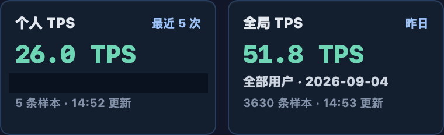

# TPS 统计口径与采集

- 个人：设置中指定用户最近 5 条有效文本生成请求，不限制为近 5 分钟。不足 5 条时按实际样本统计。
- 全局：本机时区昨天自然日 00:00 到今天 00:00，右侧边界不包含今天。每天首次打开平台窗口时计算，成功后全天复用持久化缓存；状态栏不触发全局采集。
- 统一使用生成时长加权：输出 Token 总和 / (总耗时 - 首 Token 耗时) 总秒数。不是各请求 TPS 的算术平均。
- UsageLog 不提供 HTTP 状态码时按其接口契约判断；有状态码时必须为 2xx。排除 Cyber、live、图片、音频、视频、非 Token 计费及无有效生成耗时的记录。

个人采集与通用刷新间隔独立：平台打开最多每 60 秒一次，平台隐藏且个人 TPS 状态栏启用时最多每 120 秒一次，否则停止。手动个人刷新有 15 秒冷却。切换用户先清除旧用户显示，等待低频调度，不触发即时额外请求。

每页最多 200 条，顺序分页，页间至少 150ms；个人找到 5 条有效请求即停止。单次最多读取 1 万条，不完整结果不显示 TPS。隐藏平台会中止不再需要的后续分页。个人失败按 1、2、5、15 分钟退避；全局失败仅在以后重新打开平台时按冷却和退避重试。

缓存仅保留用于统计的最小记录及覆盖/日期/更新时间元数据，不保存 Key、邮箱、请求内容或完整后台记录。配置变更或缓存版本变化后失效。所有原生窗口共用主窗口的 TPS 请求调度，平台窗口不单独拉取。

自动化测试和浏览器空状态检查不能替代真实接口、原生状态栏及服务器请求频率验收。以下分别记录本机验证结果和仍待核验的事项。

## 本机验证记录（2026-09-05）

- 原生安装版卡片已显示：个人 26.0 TPS（最近 5 条）、昨日全局 51.8 TPS（3630 条）。数值与脱敏缓存的独立加权复算一致。
- 状态栏两个指标均已显示真实数值；测试结束已恢复原有勾选项。截图只截取 TPS，个人身份已遮盖。
- 14:52:31 至 15:03:06 的本机请求日志：首次全局回溯 19 页，之后无重复全局请求；个人 5 次请求，无请求错误，隐藏且未勾选个人状态栏期间没有 TPS 请求。
- 上述日志来自客户端，不是服务器访问日志；服务器端频率核对尚未完成。本机使用确认后重新提交 PR，保留这一验证限制。
- macOS 主调度 WebView 禁用系统隐藏暂停，定时器由应用自身低频策略控制。原生可见性查询和脱敏本地快照作为跨窗口事件的兜底；usage 请求超时为 20 秒。

